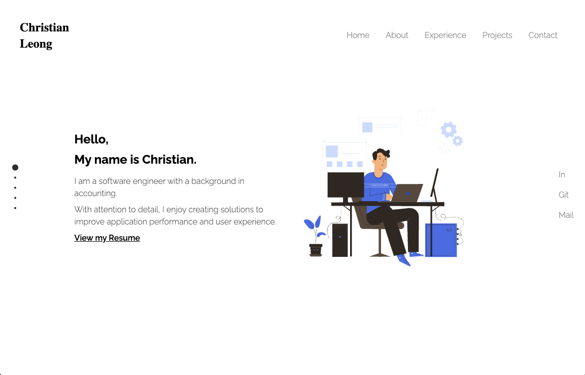

# Welcome to Christian's Portfolio Website!

Thank you for visiting my portfolio website! Here, you'll discover a showcase of my projects and accomplishments. I'm excited to share my journey and the results of my hard work with you.

I take pride in presenting this website, a creation from the ground up. Its design was crafted by [Austin Pham](https://auspham.dev/), which I used as reference.

Explore and enjoy the journey through my portfolio!

:point_right: **Live Project:** [Click here to view my project!](https://christianleong.surge.sh/)

## Table of contents
- [Overview](#page_facing_up-overview)
  - [Screenshots](#screenshots)
  - [Links](#link-links)
- [My process](#bulb-my-process)
  - [Built with](#built-with)
  - [Key takeaways](#key-takeaways)
  - [Personal challenges and achievements](#personal-challenges-and-achievements)
- [Future development](#triumph-future-deployment)

## :page_facing_up: Overview
### Screenshots

### :link: Links
- **Github:** [https://github.com/christianleong/minimalist-portfolio-v1](https://github.com/christianleong/minimalist-portfolio-v1)
- **Surge:** [https://christianleong.surge.sh/](https://christianleong.surge.sh/)

## :bulb: My process
### Built with
- HTML
- CSS
- JavaScript
- Node.js
- React
- TailwindCSS
- Fullpage.js
- Flickity (Carousel)
- Lottie (Hero Animation)
- React-responsive
- React-scroll

## Key takeaways
- My purpose for building the portfolio from scratch was to practice using React and Tailwind CSS, as well as gain confidence in solving new problems.
- It is absolutely fine to research and use someone else's portfolio website as reference, but it's important to credit them and try building it from scratch using their design, especially at the beginning fo your journey.
- I learnt to read documentation from new libraries.
- I practiced refactoring my code while maintaining website's responsiveness.

## Personal challenges and achievements
Below are some of the challenges that I faced, which turned into success:

- Overall: 
    - Added fullpage.js to allow user to scroll through the pages with a single scroll.

    - Learnt to make the pages responsive to imrpove on user experience.
- Navbar:
    - Made the navbar fixed in desktop mode, and relative in mobile mode.
    - Added styling to the navbar to indicate current active page. The active status was part of the fullpage.js feature.
    - Navbar collapses in mobile mode to form a hamburger menu.
    - Added React Scroll to allow user to scroll to the selected section when a link is clicked in the hamburger menu.
- Home page: 
    - Added Lottie animation.
    - Added animated typing effect.
- Experience page:
    - Added Tailwind CSS component and updated the CSS to incorporate it to the page layout.
- Projects page:
    - Added carousel using Flickity.
    - Added hover over effect to display the tech used in each project.

## :triumph: Future deployment
- Desktop view:
    - Display the next page at the bottom of each page and allow user to click to change page.
    - Add scroll down text at the bottom left corner of home page, which slowly disappears downwards when the user scrolls to the next page.
    - Add hover effect to social media links on right side.
- Desktop & Mobile view:
    - Dark/light mode feature 